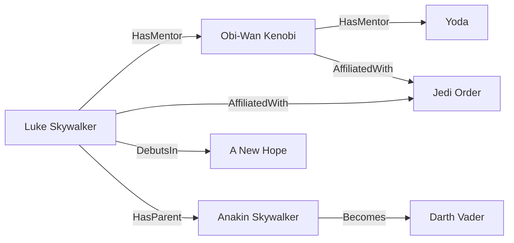

# Quick Start

## Install

```bash
brew install nanograph/tap/nanograph
```

Or build from source (requires Rust toolchain + `protoc`):

```bash
cargo install nanograph-cli
```

## The Star Wars graph

The `examples/starwars/` directory has a ready-to-run knowledge graph with typed schema, search fields, aliases, and checked-in project config.

Here's a slice of the graph:



The schema defines node types with typed properties, and edges between them:

```gq
node Character {
    slug: String @key
    name: String
    species: String
    alignment: enum(hero, villain, neutral)
    era: enum(prequel, clone_wars, original)
    tags: [String]?
}

node Film {
    slug: String @key
    name: String
    episode: I32
    release_date: Date
}

edge DebutsIn: Character -> Film
edge HasMentor: Character -> Character
edge AffiliatedWith: Character -> Faction { role: String? }
```

`@key` marks the identity property — used for edge resolution and merge operations. Types are enforced at load time and query compile time.

## Init and load

```bash
cd examples/starwars

nanograph init
nanograph load --data starwars.jsonl --mode overwrite
```

The checked-in [examples/starwars/nanograph.toml](/Users/andrew/code/nanograph/examples/starwars/nanograph.toml) supplies the default DB path, query root, mock embedding mode, and search aliases. `init` creates the database directory from the schema, and `load` ingests JSONL data with schema validation.

For new projects outside the examples, `init` also scaffolds `nanograph.toml` and `.env.nano`. See [Project Config](config.md) for the exact layout.

## Query

```bash
# semantic search
nanograph run search "father and son conflict"

# inspect agent-facing schema metadata
nanograph describe --type Character --format json

# who did Yoda train?
nanograph run --query starwars.gq --name students_of --param name="Yoda"

# cross-type traversal
nanograph run debut anakin-skywalker
```

Queries are typechecked against the schema — wrong property names, type mismatches, and invalid traversals are caught before execution:

```bash
nanograph check --query starwars.gq
```

## Next steps

- [Schema Language Reference](schema.md) — types, annotations, constraints
- [Project Config](config.md) — `nanograph.toml`, `.env.nano`, aliases, defaults
- [Query Language Reference](queries.md) — match, return, traversal, mutations
- [Search Guide](search.md) — text search, vector search, hybrid ranking
- [CLI Reference](cli-reference.md) — all commands and options
- [Star Wars Example](starwars-example.md) — worked walkthrough with output
- [Context Graph Example](context-graph-example.md) — CRM/RevOps case study
